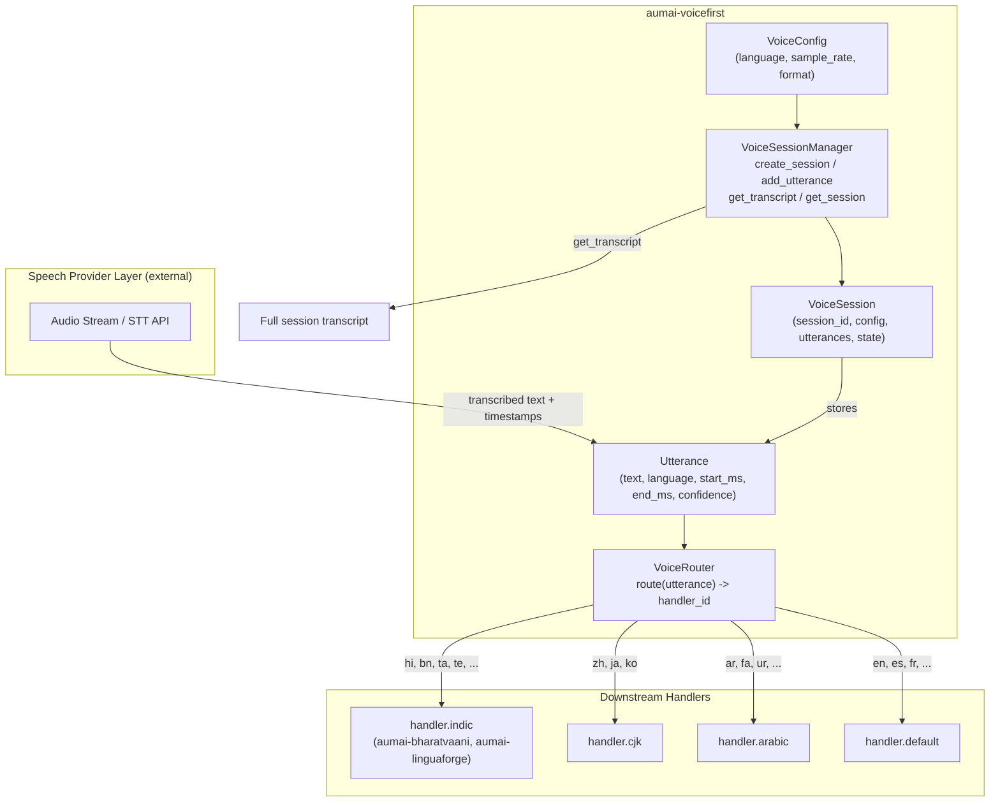

# aumai-voicefirst

**Voice-native AI interaction framework. Session management, utterance modeling, and
language-based routing for speech-driven applications.**

Part of the [AumAI](https://github.com/aumai) open-source agentic AI infrastructure suite.

[](https://github.com/aumai/aumai-voicefirst/actions)
[](https://pypi.org/project/aumai-voicefirst/)
[](LICENSE)

---

## What is VoiceFirst?

Think of a call center handling thousands of simultaneous voice interactions, each in a
different language — Hindi, Bengali, Tamil, English, Arabic. Every caller says something.
That spoken audio is transcribed into text. But then what? You need to know: which
language group does this caller belong to? What did they say? In what order? How long did
each utterance take? Is the conversation still active or has it ended?

VoiceFirst answers all of those questions with a structured, typed framework. It provides
three things:

1. **A session model** — a `VoiceSession` that holds the full state of a voice interaction:
   configuration (language, sample rate, audio format), lifecycle state (active, paused,
   completed, error), and an ordered list of utterances.

2. **A session manager** — `VoiceSessionManager` handles creating sessions, appending
   utterances, reconstructing full transcripts, and retrieving sessions by ID. It is the
   stateful orchestration layer between your speech-to-text provider and your downstream
   NLP pipeline.

3. **A language router** — `VoiceRouter` inspects each utterance and returns a handler
   identifier based on language group: Indic, CJK, Arabic, or the default Latin-script
   handler. This lets you fan out to specialized processing pipelines without writing
   language-dispatch logic yourself.

VoiceFirst does not wrap a specific speech-to-text or text-to-speech vendor. It is the
infrastructure layer above the providers — the data model and session lifecycle that your
code controls, regardless of whether you use Whisper, Google Cloud Speech, Azure Cognitive,
or any other backend.

---

## Why Does This Matter? (First Principles)

Voice AI has a fundamental asymmetry problem: speech comes in as audio bytes, but AI
pipelines work on structured text. The moment you add multiple languages, the gap widens.
You need to track:

- **What was said** and in what language
- **When it was said** (start and end timestamps in milliseconds, not just order)
- **How confident** the transcription system was
- **The session context** — is this part of an ongoing conversation or a new one?
- **Where to route** each utterance for specialized processing

Without a shared data model, every team solving this problem builds their own incompatible
session object. VoiceFirst provides that shared model so that your speech-to-text adapter,
your NLP pipeline, your TTS synthesizer, and your analytics layer all speak the same
language about voice data.

The Indic and multilingual routing focus reflects the reality that the largest voice AI
opportunity globally is in languages where existing infrastructure is weakest. Twenty-three
Indic languages, plus CJK and Arabic support, are built into the router from day one.

---

## Architecture



---

## Features

- **Structured voice sessions** with UUID session IDs, lifecycle state machine
  (`active`, `paused`, `completed`, `error`), and full utterance history.
- **Per-utterance metadata**: text content, language code, start/end timestamps in
  milliseconds, and confidence score — all validated by Pydantic.
- **Transcript reconstruction** that orders utterances by `start_ms` and joins them into
  a single readable string.
- **Language-group routing** for 23 Indic languages, 3 CJK languages, 5 Arabic-script
  languages, and a default handler for all others.
- **Audio format modeling** with `AudioFormat` enum covering WAV, MP3, OGG, FLAC.
- **TTS configuration model** (`TextToSpeechConfig`) for provider-agnostic voice synthesis
  configuration (voice ID, speed 0.25x-4.0x, pitch -20 to +20 semitones).
- **CLI** with `session` (create and persist a session) and `transcript` (reconstruct from
  saved JSON) commands.
- **Fully typed** — Pydantic models with field-level validation constraints throughout.
- **Zero heavy dependencies** — only `pydantic` and `click`.

---

## Installation

```bash
pip install aumai-voicefirst
```

Development install:

```bash
git clone https://github.com/aumai/aumai-voicefirst
cd aumai-voicefirst
pip install -e ".[dev]"
```

Requirements: Python 3.11+

---

## Quick Start

```python
from aumai_voicefirst.core import VoiceSessionManager, VoiceRouter
from aumai_voicefirst.models import AudioFormat, VoiceConfig, Utterance

# --- Create a session ---
manager = VoiceSessionManager()

config = VoiceConfig(
    language="hi",
    sample_rate=16000,
    channels=1,
    format=AudioFormat.wav,
)
session = manager.create_session(config)
print(f"Session: {session.session_id}")
print(f"State:   {session.state}")  # active

# --- Add utterances (as your STT provider produces them) ---
utterance1 = Utterance(
    text="नमस्ते, मुझे मदद चाहिए",
    language="hi",
    start_ms=0.0,
    end_ms=2400.0,
    confidence=0.93,
)
utterance2 = Utterance(
    text="मेरा नाम राज है",
    language="hi",
    start_ms=3100.0,
    end_ms=5200.0,
    confidence=0.88,
)

manager.add_utterance(session, utterance1)
manager.add_utterance(session, utterance2)

# --- Reconstruct the transcript ---
transcript = manager.get_transcript(session)
print(transcript)
# नमस्ते, मुझे मदद चाहिए
# मेरा नाम राज है

# --- Route utterances to specialized handlers ---
router = VoiceRouter()
handler = router.route(utterance1)
print(handler)  # handler.indic

# --- Retrieve session by ID ---
retrieved = manager.get_session(session.session_id)
print(retrieved.session_id == session.session_id)  # True
```

---

## CLI Reference

The CLI is installed as the `voicefirst` command.

### `session` — Create a new voice session

```bash
voicefirst session --language hi
voicefirst session --language en --sample-rate 44100 --format mp3
voicefirst session --language ta --output session.json
```

| Option | Type | Default | Description |
|--------|------|---------|-------------|
| `--language` | str | `en` | BCP-47 language code for the session |
| `--sample-rate` | int | `16000` | Audio sample rate in Hz (8000-48000) |
| `--format` | choice | `wav` | Audio format: `wav`, `mp3`, `ogg`, `flac` |
| `--output` | path | none | Save the session as JSON to this file path |

**Example output:**

```
Session ID: 3f8a1c2d-4e5b-6f7a-8b9c-0d1e2f3a4b5c
Language:   hi
Format:     wav  16000 Hz
Session saved to session.json
```

---

### `transcript` — Print transcript from a saved session file

```bash
voicefirst transcript --session session.json
```

| Option | Type | Default | Description |
|--------|------|---------|-------------|
| `--session` | path | required | Path to a session JSON file (from `session --output`) |

**Output:**

Prints the full session transcript with utterances ordered by `start_ms`. If no utterances
have been recorded, prints a message indicating that.

---

## Python API Examples

### Modeling a complete voice conversation

```python
from aumai_voicefirst.core import VoiceSessionManager
from aumai_voicefirst.models import AudioFormat, VoiceConfig, Utterance

manager = VoiceSessionManager()

# Customer support call in Tamil
config = VoiceConfig(language="ta", sample_rate=16000, format=AudioFormat.wav)
session = manager.create_session(config)

utterances = [
    Utterance(text="வணக்கம்", language="ta", start_ms=0.0, end_ms=800.0, confidence=0.95),
    Utterance(text="என் பெயர் முருகன்", language="ta", start_ms=1200.0, end_ms=2800.0, confidence=0.91),
    Utterance(text="உதவி வேண்டும்", language="ta", start_ms=3500.0, end_ms=5000.0, confidence=0.89),
]

for utt in utterances:
    manager.add_utterance(session, utt)

print(manager.get_transcript(session))
```

### Saving and restoring sessions

```python
import json
from pathlib import Path
from aumai_voicefirst.models import VoiceSession

# Save
path = Path("my_session.json")
path.write_text(session.model_dump_json(indent=2), encoding="utf-8")

# Restore
data = json.loads(path.read_text(encoding="utf-8"))
restored = VoiceSession.model_validate(data)
print(restored.session_id)
print(len(restored.utterances))
```

### Routing multiple utterances in a multilingual call center

```python
from aumai_voicefirst.core import VoiceRouter
from aumai_voicefirst.models import Utterance

router = VoiceRouter()

# Simulate a batch of utterances from different callers
incoming = [
    Utterance(text="नमस्ते", language="hi", start_ms=0, end_ms=500, confidence=0.9),
    Utterance(text="Hello there", language="en", start_ms=0, end_ms=700, confidence=0.97),
    Utterance(text="日本語テスト", language="ja", start_ms=0, end_ms=900, confidence=0.85),
    Utterance(text="مرحبا", language="ar", start_ms=0, end_ms=400, confidence=0.92),
    Utterance(text="வணக்கம்", language="ta", start_ms=0, end_ms=600, confidence=0.94),
]

for utt in incoming:
    handler = router.route(utt)
    print(f"[{utt.language}] '{utt.text}' -> {handler}")
# [hi] 'नमस्ते' -> handler.indic
# [en] 'Hello there' -> handler.default
# [ja] '日本語テスト' -> handler.cjk
# [ar] 'مرحبا' -> handler.arabic
# [ta] 'வணக்கம்' -> handler.indic
```

### Using TTS configuration

```python
from aumai_voicefirst.models import TextToSpeechConfig

# Configure a Hindi female voice
tts_config = TextToSpeechConfig(
    voice_id="provider-hindi-female-v2",
    speed=1.1,   # 10% faster than normal
    pitch=2.0,   # 2 semitones higher
)
print(tts_config.model_dump_json(indent=2))
```

### Session state management

```python
from aumai_voicefirst.core import VoiceSessionManager
from aumai_voicefirst.models import VoiceConfig, Utterance, AudioFormat

manager = VoiceSessionManager()
session = manager.create_session(VoiceConfig(language="en"))

# Add utterances while active
manager.add_utterance(
    session,
    Utterance(text="Hello", language="en", start_ms=0, end_ms=500, confidence=0.99)
)

# Transition to paused — utterances can still be added
session.state = "paused"
manager.add_utterance(
    session,
    Utterance(text="Hold on", language="en", start_ms=5000, end_ms=6000, confidence=0.95)
)

# Transition to completed — no more utterances allowed
session.state = "completed"
try:
    manager.add_utterance(
        session,
        Utterance(text="Goodbye", language="en", start_ms=8000, end_ms=9000, confidence=0.9)
    )
except ValueError as e:
    print(e)
# Cannot add utterance to session in state 'completed'.
```

---

## How It Works: Deep Dive

### Session Lifecycle

A `VoiceSession` begins in the `"active"` state upon creation. The valid lifecycle states
are:

```
active -> paused -> active    (on-hold and resume)
active -> completed           (normal call end)
active -> error               (STT failure or stream drop)
paused -> completed           (call ended while on hold)
```

`VoiceSessionManager.add_utterance` enforces that utterances can only be added when the
session is in `"active"` or `"paused"` state. Any other state raises `ValueError`.

### Transcript Reconstruction

`get_transcript` sorts all utterances by `start_ms` before joining them with newlines.
This ensures that even if utterances arrive out of order (common with async streaming STT
APIs), the transcript is always reconstructed in temporal order.

### Language Routing

`VoiceRouter.route` extracts the base language code by splitting on `-` (handling
BCP-47 tags like `"hi-IN"` or `"zh-Hant"`) and then performs set membership checks
against three language group constants:

- `_INDIC_LANGUAGES`: 23 Indic languages including all 22 Scheduled Languages plus Sinhala
- `_CJK_LANGUAGES`: `zh`, `ja`, `ko`
- `_ARABIC_LANGUAGES`: `ar`, `fa`, `ur`, `ks`, `sd`

The returned handler identifiers are strings like `"handler.indic"`. Your application is
responsible for mapping these identifiers to actual callable objects or service endpoints.

### Audio Format Enum

`AudioFormat` is a `str` enum so its values are JSON-serializable without any custom
encoder. This means `VoiceConfig` round-trips cleanly through `model_dump_json()` and
`model_validate()`.

---

## Integration with Other AumAI Projects

| Project | Integration |
|---------|-------------|
| **aumai-bharatvaani** | After `VoiceRouter` routes an utterance to `handler.indic`, pass the utterance text and language to `IndicSentimentAnalyzer` or `IndicNER` for deep Indic NLP processing. |
| **aumai-linguaforge** | Use `LanguageDetector` to verify or override the language code on an utterance when the STT provider's language detection is uncertain. Use `TextNormalizer` to clean transcribed text before downstream processing. |
| **aumai-specs** | `VoiceSession`, `VoiceConfig`, `Utterance`, and `TextToSpeechConfig` are all Pydantic models. Generate JSON Schema from them with `model_json_schema()` for use in API contracts. |

---

## Contributing

Contributions are welcome. Please read `CONTRIBUTING.md` before opening a pull request.

- New audio formats: extend the `AudioFormat` enum.
- New language routing groups: update the set constants in `core.py`.
- Session persistence: the current implementation is in-memory. A persistent backend
  (e.g. Redis, Postgres) can be added by subclassing `VoiceSessionManager`.
- All new features require tests in `tests/`.

```bash
make test       # run pytest
make lint       # ruff check
make typecheck  # mypy --strict
```

---

## License

Apache License 2.0. See [LICENSE](LICENSE) for the full text.

```
Copyright 2024 AumAI

Licensed under the Apache License, Version 2.0 (the "License");
you may not use this file except in compliance with the License.
You may obtain a copy of the License at

    http://www.apache.org/licenses/LICENSE-2.0
```
